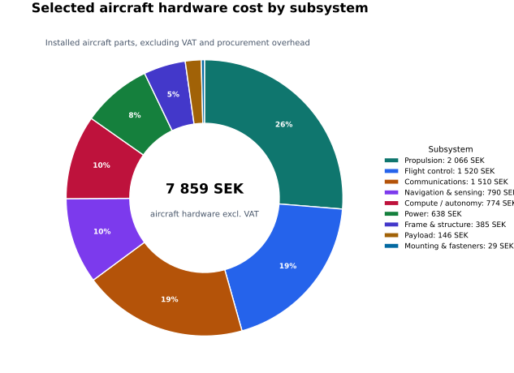
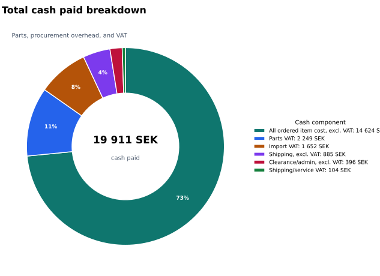

# Bill of Materials

This page shows the current parts plan for the BRO-Air study circle build. Use it to understand what each subsystem needs, which parts are currently selected, and how the build cost is shaping up.

The BOM is a live planning view, not a final purchasing recommendation. Prices, availability, shipping, import handling, and substitutions can change as we learn more and receive the ordered parts.

The cost tables separate part comparison from procurement overhead. Subsystem costs use item prices excluding VAT so the parts can be compared more clearly. Shipping, service fees, clearance/admin charges, and VAT are shown separately where they affect the total cash paid.

Last generated: 2026-05-05.

## Cost Summary

| Component | Amount (SEK) | Notes |
| --- | ---: | --- |
| Comparable parts ex VAT | 14,623.90 | Parts-only comparison cost. |
| Procurement overhead ex VAT | 1,281.38 | Shipping plus clearance/admin, excluding VAT where modeled. |
| VAT | 4,005.52 | Parts VAT + shipping/service VAT + import VAT. |
| Total cash paid | 19,910.81 | Actual cash outlay across all orders. |

## VAT Categories

| Category | Amount (SEK) | Meaning |
| --- | ---: | --- |
| Parts VAT | 2,249.31 | VAT embedded in VAT-bearing item purchases. |
| Shipping/service VAT | 104.21 | VAT on shipping or carrier service charges. |
| Import VAT | 1,652.00 | VAT paid at import; this may be based on imported goods plus shipping or other customs-base amounts. |

## Cost Visuals

These charts are generated from the processed BOM cost outputs.

## Selected Build Cost by Subsystem

Comparable parts view only: item cost excluding VAT, with shipping and clearance kept as order-level procurement overhead.

| Subsystem | Core Cost (SEK ex VAT) | Optional Cost (SEK ex VAT) | Core Build Qty | Optional Build Qty |
| --- | ---: | ---: | ---: | ---: |
| Propulsion | 2,396.61 | 0.00 | 13 | 0 |
| Flight control | 1,520.04 | 0.00 | 1 | 0 |
| Communications | 1,207.28 | 303.20 | 2 | 1 |
| Navigation & sensing | 503.57 | 286.49 | 1 | 1 |
| Compute / autonomy | 774.01 | 0.00 | 2 | 0 |
| Power | 637.90 | 0.00 | 3 | 0 |
| Frame & structure | 384.61 | 0.00 | 1 | 0 |
| Payload | 0.00 | 146.40 | 0 | 1 |
| Mounting & fasteners | 28.89 | 0.00 | 2 | 0 |

## Selected Items by Subsystem

These are the parts currently classified as selected for the build, grouped by subsystem.

### Communications

| Item | Build Qty | Need | Comparable Cost (SEK ex VAT) | Vendor | Link |
| --- | ---: | --- | ---: | --- | --- |
| Holybro - SiK Telemetry Radio Set V3 | 1 | Required | 737.68 | 3DXR | [Link](https://www.3dxr.co.uk/radio-gear-c33/telemetry-c31/433-mhz-telemetry-c32/holybro-sik-telemetry-radio-set-v3-100mw-433mhz-p3021) |
| Kahuna With Range ExtendingWiFi Adapter | 1 | Optional | 303.20 | Beyond Robotics | [Link](https://www.beyondrobotix.com/products/kahuna?variant=52265624830289) |
| Receiver - FrSky X8R | 1 | Required | 469.60 | Elefun | [Link](https://www.elefun.se/vara-33758/radioutrustning-mottagare-frsky-x8r) |

### Compute / autonomy

| Item | Build Qty | Need | Comparable Cost (SEK ex VAT) | Vendor | Link |
| --- | ---: | --- | ---: | --- | --- |
| Raspberry Pi 4 Model B | 1 | Required | 679.20 | Amazon | [Link](https://www.amazon.se/dp/B07TD42S27?ref=ppx_yo2ov_dt_b_fed_asin_title) |
| SanDisk Ultra 64GB microSDXC Card | 1 | Required | 94.81 | Amazon | [Link](https://www.amazon.se/-/en/dp/B0B7NXBM6P?th=1) |

### Flight control

| Item | Build Qty | Need | Comparable Cost (SEK ex VAT) | Vendor | Link |
| --- | ---: | --- | ---: | --- | --- |
| Pixhawk 6C | 1 | Required | 1,520.04 | Holybro | [Link](https://holybro.com/products/pixhawk-6c?_pos=2&_sid=2e48f56f9&_ss=r) |

### Frame & structure

| Item | Build Qty | Need | Comparable Cost (SEK ex VAT) | Vendor | Link |
| --- | ---: | --- | ---: | --- | --- |
| S500 V2 Frame Kit | 1 | Required | 384.61 | Holybro | [Link](https://holybro.com/collections/multicopter-kit/products/spare-parts-x500-v2-kit) |

### Ground support

| Item | Build Qty | Need | Comparable Cost (SEK ex VAT) | Vendor | Link |
| --- | ---: | --- | ---: | --- | --- |
| Charger - SkyRC S100 Neo Charger AC100W/DC200W | 1 | Required | 548.00 | Elefun | [Link](https://www.elefun.se/vara-63967/computerlader-skyrc-s100-neo-ac100w-dc200w) |
| LiPo-Safe Bag | 1 | Required | 124.80 | Elefun | [Link](https://www.elefun.se/vara-63844/saker-laddvaska-elefun-lipo-safe-bag-transportvaska-m) |
| SkyRC Multi-balance card | 1 | Optional | 105.60 | Elefun | [Link](https://www.elefun.se/vara-25070/laddningstillbehor-balanseringskontakt-skyrc-multibalanseringskort-xh-tp-fp-hp-pq-eh) |
| Transmitter - FrSky Taranis Q X7 ACCESS Black EU | 1 | Required | 1,488.00 | Elefun | [Link](https://www.elefun.se/vara-48092/radioutrustning-sandare-frsky-taranis-q-x7-access-black-eu) |
| Transmitter Batteries - Samsung INR18650-35E 3400mA 3.6V Li-ion | 2 | Required | 78.40 | Elefun | [Link](https://www.elefun.se/vara-40233/batteri-nimh-samsung-inr18650-35e-3400ma-36v-liion) |
| XT60 to DC5525 Power Cable | 1 | Optional | 140.43 | Amazon | [Link](https://www.amazon.se/dp/B0DRCHK4TM?ref=ppx_yo2ov_dt_b_fed_asin_title&th=1) |

### Mounting & fasteners

| Item | Build Qty | Need | Comparable Cost (SEK ex VAT) | Vendor | Link |
| --- | ---: | --- | ---: | --- | --- |
| CubePilot 3M Stickers | 1 | Required | 29.39 | 3DXR | [Link](https://www.3dxr.co.uk/autopilots-c2/the-cube-aka-pixhawk-2-1-c9/cube-autopilot-and-combos-c10/cubepilot-cubepilot-3m-stickers-p6088) |
| Double sided acrylic tape (3m) | 1 | Required | 55.80 | 3DXR | [Link](https://www.3dxr.co.uk/building-c23/tapes-c130/double-sided-c466/3dxr-3-meter-double-sided-acrylic-tape-p5242) |
| Tarot Hook & Loop Fastening Strap (360mm) | 2 | Required | 28.89 | 3DXR | [Link](https://www.3dxr.co.uk/building-c23/tapes-c130/velcro-c350/tarot-hook-loop-fastening-strap-360mm-tl2698-p3565) |

### Navigation & sensing

| Item | Build Qty | Need | Comparable Cost (SEK ex VAT) | Vendor | Link |
| --- | ---: | --- | ---: | --- | --- |
| InnoMaker Global Shutter Camera Module | 1 | Optional | 286.49 | Amazon | [Link](https://www.amazon.se/-/en/dp/B09WTP5GZH?th=1) |
| M9N GPS - IST8310 | 1 | Required | 503.57 | Holybro | [Link](https://holybro.com/products/m9n-gps) |

### Payload

| Item | Build Qty | Need | Comparable Cost (SEK ex VAT) | Vendor | Link |
| --- | ---: | --- | ---: | --- | --- |
| Holybro S500 V2 Payload Platform Board V2 | 1 | Optional | 146.40 | HAB | [Link](https://hab.se/modeller-delar/holybro-s500-v2-payload-platform-board-v2) |

### Power

| Item | Build Qty | Need | Comparable Cost (SEK ex VAT) | Vendor | Link |
| --- | ---: | --- | ---: | --- | --- |
| Holybro S500 V2 Battery Mounting Board V2 | 1 | Required | 104.80 | HAB | [Link](https://hab.se/modeller-delar/holybro-s500-v2-battery-mounting-board-v2) |
| LiPo Battery 4s 3300mAh - 40C - CNHL XT60 | 1 | Required | 359.20 | Elefun | [Link](https://www.elefun.se/vara-61453/batteri-lipo-4s-3300mah-40c-cnhl-xt60) |
| PM02 Power Module | 1 | Required | 173.90 | Holybro | [Link](https://holybro.com/collections/power-modules-pdbs/products/pm02-v3-12s-power-module) |

### Propulsion

| Item | Build Qty | Need | Comparable Cost (SEK ex VAT) | Vendor | Link |
| --- | ---: | --- | ---: | --- | --- |
| Holybro S500 V2 Motor 2216-920KV-CCW (1PC) | 2 | Required | 552.00 | HAB | [Link](https://hab.se/modeller-delar/holybro-s500-v2-motor-2216-920kv-ccw-1pc) |
| Holybro S500 V2 Motor 2216-920KV-CW (1PC) | 2 | Required | 552.00 | HAB | [Link](https://hab.se/modeller-delar/holybro-s500-v2-motor-2216-920kv-cw-1pc) |
| Holybro S500 V2-BLHeli S 20A ESC(1PC) | 4 | Required | 771.20 | HAB | [Link](https://hab.se/modeller-delar/holybro-s500-v2-blheli-s-20a-esc1pc) |
| Holybro X500/S500 V2 Propeller1045 (2pair) | 1 | Required | 191.20 | HAB | [Link](https://hab.se/modeller-delar/holybro-x500s500-v2-propeller1045-2pair) |
| T-Motor T1045 Self locking Props - Pair | 4 | Required | 330.21 | 3DXR | [Link](https://www.3dxr.co.uk/multirotor-c3/multirotor-props-c265/t-motor-t1045-self-locking-props-pair-p3209) |

### Tools & assembly

| Item | Build Qty | Need | Comparable Cost (SEK ex VAT) | Vendor | Link |
| --- | ---: | --- | ---: | --- | --- |
| Fixpoint 45246 Desoldering Braid, 2 mm x 1.5 m | 1 | Optional | 42.40 | Amazon | [Link](https://www.amazon.se/-/en/dp/B01M7YZ3FM?th=1) |
| Leaded Solder 100G - 0.8mm Diameter | 1 | Required | 82.21 | 3DXR | [Link](https://www.3dxr.co.uk/building-c23/consumables-c24/team-black-sheep-tbs-solder-100g-p5484) |
| Soldering Brass Sponge | 1 | Optional | 118.40 | Amazon | [Link](https://www.amazon.se/-/en/dp/B08FQBS97L) |
| Soldering Pen - PINECIL version 2 | 1 | Required | 699.46 | Amazon | [Link](https://www.amazon.se/dp/B096X6SG13?ref=ppx_yo2ov_dt_b_fed_asin_title) |

### Wiring & connectors

| Item | Build Qty | Need | Comparable Cost (SEK ex VAT) | Vendor | Link |
| --- | ---: | --- | ---: | --- | --- |
| 14 AWG Silicone Wire Black (1m) | 2 | Required | 19.59 | 3DXR | [Link](https://www.3dxr.co.uk/electronics-c78/cable-wire-c295/silicon-cables-c297/amass-awg-silicone-wire-cable-p5271) |
| 14 AWG Silicone Wire Red (1m) | 2 | Required | 19.59 | 3DXR | [Link](https://www.3dxr.co.uk/electronics-c78/cable-wire-c295/silicon-cables-c297/amass-awg-silicone-wire-cable-p5271) |
| 20 AWG Silicone Wire Black (1m) | 2 | Required | 10.29 | 3DXR | [Link](https://www.3dxr.co.uk/electronics-c78/cable-wire-c295/silicon-cables-c297/amass-awg-silicone-wire-cable-p5271) |
| 20 AWG Silicone Wire Red (1m) | 2 | Required | 10.29 | 3DXR | [Link](https://www.3dxr.co.uk/electronics-c78/cable-wire-c295/silicon-cables-c297/amass-awg-silicone-wire-cable-p5271) |
| 28 AWG Silicone Wire Black (1m) | 2 | Required | 5.33 | 3DXR | [Link](https://www.3dxr.co.uk/electronics-c78/cable-wire-c295/silicon-cables-c297/amass-awg-silicone-wire-cable-p5271) |
| 28 AWG Silicone Wire Blue (1m) | 2 | Required | 5.33 | 3DXR | [Link](https://www.3dxr.co.uk/electronics-c78/cable-wire-c295/silicon-cables-c297/amass-awg-silicone-wire-cable-p5271) |
| 28 AWG Silicone Wire Red (1m) | 2 | Required | 5.33 | 3DXR | [Link](https://www.3dxr.co.uk/electronics-c78/cable-wire-c295/silicon-cables-c297/amass-awg-silicone-wire-cable-p5271) |
| 28 AWG Silicone Wire White (1m) | 2 | Required | 5.33 | 3DXR | [Link](https://www.3dxr.co.uk/electronics-c78/cable-wire-c295/silicon-cables-c297/amass-awg-silicone-wire-cable-p5271) |
| 28 AWG Silicone Wire Yellow (1m) | 2 | Required | 5.33 | 3DXR | [Link](https://www.3dxr.co.uk/electronics-c78/cable-wire-c295/silicon-cables-c297/amass-awg-silicone-wire-cable-p5271) |

## All Parts and Classification

This table shows every extracted part line together with the classification fields used for the public cost rollups.

| Subsystem | Item | Role | Need | Selection | Cost Bucket | Ordered Qty | Build Qty | Spare Qty | Comparable Cost (SEK ex VAT) | Vendor | Link |
| --- | --- | --- | --- | --- | --- | ---: | ---: | ---: | ---: | --- | --- |
| Communications | Holybro - SiK Telemetry Radio Set V3 | Component | Required | Selected | Core drone components | 1 | 1 | 0 | 737.68 | 3DXR | [Link](https://www.3dxr.co.uk/radio-gear-c33/telemetry-c31/433-mhz-telemetry-c32/holybro-sik-telemetry-radio-set-v3-100mw-433mhz-p3021) |
| Communications | Kahuna With Range ExtendingWiFi Adapter | Component | Optional | Selected | Optional selected add-ons | 1 | 1 | 0 | 303.20 | Beyond Robotics | [Link](https://www.beyondrobotix.com/products/kahuna?variant=52265624830289) |
| Communications | Receiver - FrSky X8R | Component | Required | Selected | Core drone components | 1 | 1 | 0 | 469.60 | Elefun | [Link](https://www.elefun.se/vara-33758/radioutrustning-mottagare-frsky-x8r) |
| Compute / autonomy | Raspberry Pi 4 Model B | Component | Required | Selected | Core drone components | 1 | 1 | 0 | 679.20 | Amazon | [Link](https://www.amazon.se/dp/B07TD42S27?ref=ppx_yo2ov_dt_b_fed_asin_title) |
| Compute / autonomy | SanDisk Ultra 64GB microSDXC Card | Component | Required | Selected | Core drone components | 1 | 1 | 0 | 94.81 | Amazon | [Link](https://www.amazon.se/-/en/dp/B0B7NXBM6P?th=1) |
| Flight control | GH1.25 Connectors & Pre-Shrunk Silicone Cables Kit For Pixhawk 4 Pixhawk 6C | Component | Required | Alternative | Alternatives not selected | 1 | 0 | 0 | 175.20 | Amazon | [Link](https://www.amazon.se/dp/B07PBHN7TM?ref=ppx_yo2ov_dt_b_fed_asin_title) |
| Flight control | Pixhawk 6C | Component | Required | Secondary/spare | Spare / secondary | 1 | 0 | 1 | 1,520.04 | Holybro | [Link](https://holybro.com/products/pixhawk-6c?_pos=2&_sid=2e48f56f9&_ss=r) |
| Flight control | Pixhawk 6C | Component | Required | Selected | Core drone components | 1 | 1 | 0 | 1,520.04 | Holybro | [Link](https://holybro.com/products/pixhawk-6c?_pos=2&_sid=2e48f56f9&_ss=r) |
| Frame & structure | S500 V2 Frame Kit | Component | Required | Selected | Core drone components | 1 | 1 | 0 | 384.61 | Holybro | [Link](https://holybro.com/collections/multicopter-kit/products/spare-parts-x500-v2-kit) |
| Ground support | Charger - SkyRC S100 Neo Charger AC100W/DC200W | Support equipment | Required | Selected | Tools / support equipment | 1 | 0 | 0 | 548.00 | Elefun | [Link](https://www.elefun.se/vara-63967/computerlader-skyrc-s100-neo-ac100w-dc200w) |
| Ground support | LiPo-Safe Bag | Support equipment | Required | Selected | Tools / support equipment | 1 | 0 | 0 | 124.80 | Elefun | [Link](https://www.elefun.se/vara-63844/saker-laddvaska-elefun-lipo-safe-bag-transportvaska-m) |
| Ground support | SkyRC Multi-balance card | Support equipment | Optional | Selected | Tools / support equipment | 1 | 0 | 0 | 105.60 | Elefun | [Link](https://www.elefun.se/vara-25070/laddningstillbehor-balanseringskontakt-skyrc-multibalanseringskort-xh-tp-fp-hp-pq-eh) |
| Ground support | Transmitter - FrSky Taranis Q X7 ACCESS Black EU | Support equipment | Required | Selected | Tools / support equipment | 1 | 0 | 0 | 1,488.00 | Elefun | [Link](https://www.elefun.se/vara-48092/radioutrustning-sandare-frsky-taranis-q-x7-access-black-eu) |
| Ground support | Transmitter Batteries - Samsung INR18650-35E 3400mA 3.6V Li-ion | Support equipment | Required | Selected | Tools / support equipment | 2 | 0 | 0 | 78.40 | Elefun | [Link](https://www.elefun.se/vara-40233/batteri-nimh-samsung-inr18650-35e-3400ma-36v-liion) |
| Ground support | XT60 to DC5525 Power Cable | Support equipment | Optional | Selected | Tools / support equipment | 1 | 0 | 0 | 140.43 | Amazon | [Link](https://www.amazon.se/dp/B0DRCHK4TM?ref=ppx_yo2ov_dt_b_fed_asin_title&th=1) |
| Miscellaneous | Fermerry 28AWG | Component | Required | Alternative | Alternatives not selected | 1 | 0 | 0 | 103.99 | Amazon | [Link](https://www.amazon.se/-/en/dp/B098JKC4HW?th=1) |
| Mounting & fasteners | CubePilot 3M Stickers | Consumable | Required | Selected | Consumables | 1 | 0 | 0 | 29.39 | 3DXR | [Link](https://www.3dxr.co.uk/autopilots-c2/the-cube-aka-pixhawk-2-1-c9/cube-autopilot-and-combos-c10/cubepilot-cubepilot-3m-stickers-p6088) |
| Mounting & fasteners | Double sided acrylic tape (3m) | Consumable | Required | Selected | Consumables | 1 | 0 | 0 | 55.80 | 3DXR | [Link](https://www.3dxr.co.uk/building-c23/tapes-c130/double-sided-c466/3dxr-3-meter-double-sided-acrylic-tape-p5242) |
| Mounting & fasteners | Tarot Hook & Loop Fastening Strap (360mm) | Hardware | Required | Selected | Core drone components | 2 | 2 | 0 | 28.89 | 3DXR | [Link](https://www.3dxr.co.uk/building-c23/tapes-c130/velcro-c350/tarot-hook-loop-fastening-strap-360mm-tl2698-p3565) |
| Navigation & sensing | OV9281 1MP USB camera module | Component | Optional | Alternative | Alternatives not selected | 1 | 0 | 0 | 298.46 | Amazon | [Link](https://www.amazon.se/dp/B0GXLGHSLF?ref=ppx_yo2ov_dt_b_fed_asin_title) |
| Navigation & sensing | InnoMaker Global Shutter Camera Module | Component | Optional | Selected | Optional selected add-ons | 1 | 1 | 0 | 286.49 | Amazon | [Link](https://www.amazon.se/-/en/dp/B09WTP5GZH?th=1) |
| Navigation & sensing | M9N GPS - IST8310 | Component | Required | Selected | Core drone components | 1 | 1 | 0 | 503.57 | Holybro | [Link](https://holybro.com/products/m9n-gps) |
| Payload | Holybro S500 V2 Payload Platform Board V2 | Hardware | Optional | Selected | Optional selected add-ons | 1 | 1 | 0 | 146.40 | HAB | [Link](https://hab.se/modeller-delar/holybro-s500-v2-payload-platform-board-v2) |
| Power | LiPo Battery 4s 4000mAh - 60C - Ace G-Tech XT60 | Component | Required | Alternative | Alternatives not selected | 1 | 0 | 0 | 564.00 | Elefun | [Link](https://www.elefun.se/vara-72831/batteri-lipo-4s-4000mah-60c-gens-ace-g-tech-xt60) |
| Power | PM02 Power Module | Component | Required | Secondary/spare | Spare / secondary | 1 | 0 | 1 | 173.90 | Holybro | [Link](https://holybro.com/collections/power-modules-pdbs/products/pm02-v3-12s-power-module) |
| Power | Holybro S500 V2 Battery Mounting Board V2 | Component | Required | Selected | Core drone components | 1 | 1 | 0 | 104.80 | HAB | [Link](https://hab.se/modeller-delar/holybro-s500-v2-battery-mounting-board-v2) |
| Power | LiPo Battery 4s 3300mAh - 40C - CNHL XT60 | Component | Required | Selected | Core drone components | 1 | 1 | 0 | 359.20 | Elefun | [Link](https://www.elefun.se/vara-61453/batteri-lipo-4s-3300mah-40c-cnhl-xt60) |
| Power | PM02 Power Module | Component | Required | Selected | Core drone components | 1 | 1 | 0 | 173.90 | Holybro | [Link](https://holybro.com/collections/power-modules-pdbs/products/pm02-v3-12s-power-module) |
| Propulsion | Holybro S500 V2 Motor 2216-920KV-CCW (1PC) | Component | Required | Selected | Core drone components | 2 | 2 | 0 | 552.00 | HAB | [Link](https://hab.se/modeller-delar/holybro-s500-v2-motor-2216-920kv-ccw-1pc) |
| Propulsion | Holybro S500 V2 Motor 2216-920KV-CW (1PC) | Component | Required | Selected | Core drone components | 2 | 2 | 0 | 552.00 | HAB | [Link](https://hab.se/modeller-delar/holybro-s500-v2-motor-2216-920kv-cw-1pc) |
| Propulsion | Holybro S500 V2-BLHeli S 20A ESC(1PC) | Component | Required | Selected | Core drone components | 4 | 4 | 0 | 771.20 | HAB | [Link](https://hab.se/modeller-delar/holybro-s500-v2-blheli-s-20a-esc1pc) |
| Propulsion | Holybro X500/S500 V2 Propeller1045 (2pair) | Component | Required | Selected | Core drone components | 1 | 1 | 0 | 191.20 | HAB | [Link](https://hab.se/modeller-delar/holybro-x500s500-v2-propeller1045-2pair) |
| Propulsion | T-Motor T1045 Self locking Props - Pair | Component | Required | Selected | Core drone components | 4 | 4 | 0 | 330.21 | 3DXR | [Link](https://www.3dxr.co.uk/multirotor-c3/multirotor-props-c265/t-motor-t1045-self-locking-props-pair-p3209) |
| Tools & assembly | Fixpoint 45246 Desoldering Braid, 2 mm x 1.5 m | Consumable | Optional | Selected | Consumables | 1 | 0 | 0 | 42.40 | Amazon | [Link](https://www.amazon.se/-/en/dp/B01M7YZ3FM?th=1) |
| Tools & assembly | Leaded Solder 100G - 0.8mm Diameter | Consumable | Required | Selected | Consumables | 1 | 0 | 0 | 82.21 | 3DXR | [Link](https://www.3dxr.co.uk/building-c23/consumables-c24/team-black-sheep-tbs-solder-100g-p5484) |
| Tools & assembly | Soldering Brass Sponge | Consumable | Optional | Selected | Consumables | 1 | 0 | 0 | 118.40 | Amazon | [Link](https://www.amazon.se/-/en/dp/B08FQBS97L) |
| Tools & assembly | Soldering Pen - PINECIL version 2 | Support equipment | Required | Selected | Tools / support equipment | 1 | 0 | 0 | 699.46 | Amazon | [Link](https://www.amazon.se/dp/B096X6SG13?ref=ppx_yo2ov_dt_b_fed_asin_title) |
| Wiring & connectors | 14 AWG Silicone Wire Black (1m) | Consumable | Required | Selected | Consumables | 2 | 0 | 0 | 19.59 | 3DXR | [Link](https://www.3dxr.co.uk/electronics-c78/cable-wire-c295/silicon-cables-c297/amass-awg-silicone-wire-cable-p5271) |
| Wiring & connectors | 14 AWG Silicone Wire Red (1m) | Consumable | Required | Selected | Consumables | 2 | 0 | 0 | 19.59 | 3DXR | [Link](https://www.3dxr.co.uk/electronics-c78/cable-wire-c295/silicon-cables-c297/amass-awg-silicone-wire-cable-p5271) |
| Wiring & connectors | 20 AWG Silicone Wire Black (1m) | Consumable | Required | Selected | Consumables | 2 | 0 | 0 | 10.29 | 3DXR | [Link](https://www.3dxr.co.uk/electronics-c78/cable-wire-c295/silicon-cables-c297/amass-awg-silicone-wire-cable-p5271) |
| Wiring & connectors | 20 AWG Silicone Wire Red (1m) | Consumable | Required | Selected | Consumables | 2 | 0 | 0 | 10.29 | 3DXR | [Link](https://www.3dxr.co.uk/electronics-c78/cable-wire-c295/silicon-cables-c297/amass-awg-silicone-wire-cable-p5271) |
| Wiring & connectors | 28 AWG Silicone Wire Black (1m) | Consumable | Required | Selected | Consumables | 2 | 0 | 0 | 5.33 | 3DXR | [Link](https://www.3dxr.co.uk/electronics-c78/cable-wire-c295/silicon-cables-c297/amass-awg-silicone-wire-cable-p5271) |
| Wiring & connectors | 28 AWG Silicone Wire Blue (1m) | Consumable | Required | Selected | Consumables | 2 | 0 | 0 | 5.33 | 3DXR | [Link](https://www.3dxr.co.uk/electronics-c78/cable-wire-c295/silicon-cables-c297/amass-awg-silicone-wire-cable-p5271) |
| Wiring & connectors | 28 AWG Silicone Wire Red (1m) | Consumable | Required | Selected | Consumables | 2 | 0 | 0 | 5.33 | 3DXR | [Link](https://www.3dxr.co.uk/electronics-c78/cable-wire-c295/silicon-cables-c297/amass-awg-silicone-wire-cable-p5271) |
| Wiring & connectors | 28 AWG Silicone Wire White (1m) | Consumable | Required | Selected | Consumables | 2 | 0 | 0 | 5.33 | 3DXR | [Link](https://www.3dxr.co.uk/electronics-c78/cable-wire-c295/silicon-cables-c297/amass-awg-silicone-wire-cable-p5271) |
| Wiring & connectors | 28 AWG Silicone Wire Yellow (1m) | Consumable | Required | Selected | Consumables | 2 | 0 | 0 | 5.33 | 3DXR | [Link](https://www.3dxr.co.uk/electronics-c78/cable-wire-c295/silicon-cables-c297/amass-awg-silicone-wire-cable-p5271) |
