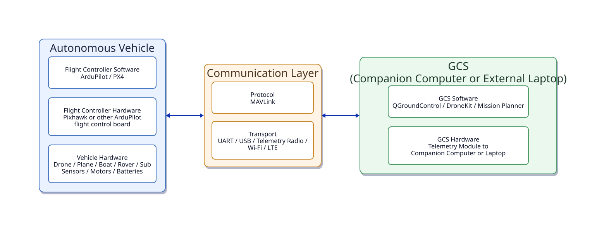

# Overview

BRO teaches a practical, reusable systems template for building and operating autonomous platforms across multiple domains.

The goal is not to memorize one specific drone build. The goal is to understand a system architecture that can transfer across aerial, ground, surface, and underwater vehicles.

We will use the following diagram to organize the major layers involved in a working autonomous system and we will structure learning and building around these abstractions.

At a high level, the diagram separates the system into three parts:

- the autonomous vehicle
- the communication layer between the vehicle and external compute or operator-side tools
- the ground control station (GCS) or companion computer used to configure, monitor, and interact with the system

Each block is also organized as a stack of increasing abstraction from bottom to top. 

This abstraction view is central to the course. BRO is structured around understanding how to get each block built, running, calibrated, and interfaced with the others.

A key feature of this model is that most of the blocks and sub-blocks remain the same across domains. The main part that changes is the **vehicle hardware** layer at the bottom left of the diagram. A multicopter, rover, boat, or sub may differ in physical structure, actuation, and sensing, but the surrounding system architecture is often remarkably similar. As a result of open-source hardware and software development, once the vehicle is assembled and its electronics are integrated with a flight controller (such as a Pixhawk), it can often be configured, calibrated, and controlled through nearly the same workflow across domains.

